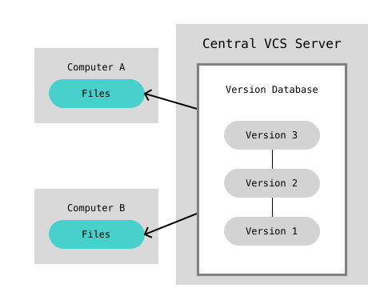

<!--
class: slides
-->
# Git講習会

### 2024年度

<!--
_class: title
-->

---

## 自己紹介

---

#  @H1rono_K

<!--
_class: user
-->

- ヒロノと言います
- 22B 数理計算
- SysAdの人間
    - Jomon サーバーメンテナー
    - traPortfolio サーバー
- 主にRustを書いています

---

## 座学編

- Gitの目的
- Gitとは
- Gitの仕組み
- ホスティングサービス

---

## Gitの目的

---

## 例えば、文章を書く時

※ プログラムもほぼ文章(テキストデータ)

---

<!-- これを書くとスライド上部にちょっと空間ができて画像が上に詰まらない -->
##

### これで保存

---

##

### 再度保存

---

##

### 元に戻したいときは？

「簡単だよ！元に戻すボタンがあるじゃないか！」

---

## でも、Wordを閉じて再度開くと...

---

##

<!--  -->

 

---

## 変更履歴は保存(永続化)されない

「元に戻す」は、一時的に
**編集ソフトを開いている時だけ**
保存されている履歴を戻している

---

# 困る

(特にプログラムを書いている時)

---

## 何が困るのか

例をいくつか見よう

- アプリケーションに問題が起きた時
    - 問題の発生前まで戻すこと(復旧)ができない
    - 変更を見て原因を調査したい
- 新機能のテストをしたいとき
    - 今動いているプログラムを保存したまま最新版をテストしたい

---

## 解決策

**変更履歴が保存・復元できれば良い**

1. 保存のタイミングで、都度別名で保存する
    - データのサイズが膨大になる
    - ファイル名をきちんとしないと、履歴を追うのが面倒になる
1. 同じファイルに「バージョン」を付けて、任意の時点での状態を保存する
    - バージョン = 「どの時点のものか」を表す管理番号
        - バージョンさえ指定すれば、その時の状態にいつでも戻せる
    - これが**バージョン管理**

---

## バージョン管理システム

- バージョン管理を実現するためのシステム
- Version Database内にVersionを保存する
    - 主に2種類の保存法(DeltaとSnapshot)
    - 詳しくは割愛

---

## Gitとは

---

## Git

- https://git-scm.com
- バージョン管理システムの一つ
    - 今世界でもっとも使われているバージョン管理システム
    - 他にはMercurial、Subversionなどがある
- ファイルの変更の履歴を保存・管理
- プログラマを中心に、様々な人に愛用されている
    - 元はLinuxの作者が自分のプログラムの管理用に作ったので、
      「プログラマ向け」というのは意識されているであろう

---

---

## バージョン管理システムの分類

データをどこに置くかで大きく分類できる
- ローカル
- 集中
- 分散

---

## 用語の確認

- ローカル
    - プログラムを書く人それぞれのPC
    - 基本的に所有者しか見れない
- サーバー
    - 共有されていて、みんなが見れるPC

---

## ローカル バージョン管理

- ローカルのみに状態を保存する
- 他人と共有がしにくい

---

## 集中 バージョン管理

- サーバーに状態を保存する
- 複数人で共有できる
- サーバーが落ちたり壊れると被害が大きい
    - アクセスできない / データが消える

---

## 分散 バージョン管理

- ローカルとサーバーに状態を保存
- 任意のタイミングで中身を同期する
- ローカルもサーバーもバックアップになれる
    - データが失われにくい

---

## Git

分散バージョン管理システム
→ 各バージョンについて、以下の情報が「状態」として保存される

- **いつ保存したか**
- **誰が保存したか**
- **プログラムのスナップショット**
    - バージョンごとの差分を確認できる

---

# Gitの仕組み

Gitを構成する要素を見ていこう

---

## Repository

**Gitがバージョン管理する単位**

- ディレクトリ (= フォルダ) + Version Database
- 変更履歴の保存はリポジトリ単位で行われる
    - ファイルの構造
    - ファイルの状態

---

## Local Repository / Remote Repository

**Gitにおける分散バージョン管理システムの要素の呼び名**

- ローカルリポジトリ
    - ローカルにあるリポジトリ
- リモートリポジトリ
    - サーバーにあるリポジトリ
    - 全員に共有される

---

---

## Commit

- 「バージョン」のGit内での呼び名
    - セーブポイントを作るイメージ
    - 状態のスナップショットが一意なIDと結び付けられる
- Gitはコミットを基準として状態を移動する
    - 各コミット時の状態が保存される
    - コミットされていない時点には移れない
        - コミットの間の編集中の状態とか
- HEAD: 自分が今いるコミット(デフォルトはブランチの最新コミット)

---

## Staging Area

- https://git-scm.com/about/staging-area
- 無暗に全ての変更を一度にコミットさせないためのGitの機能
- 関連するファイル群を選択し、コミットする範囲を決める
- 適切な粒度でコミットを作ることができる

---

## Branch

- コミットの集まり / 繋がり
    - リポジトリ内に複数存在する
    - 開発の本流から分岐できる
    - 本流を妨げることなく開発を進めるための仕組み
- **main** (旧: master)
    - 本流となるブランチの名前として主に用いられる

---

---

## Push / Pull

- ローカル - リモート間のコミット同期
- プッシュ
    - ローカルのコミットをリモートに送る
    - プッシュするまではリモートの状態は変わらない
    - ローカル → リモート
- プル
    - リモートに集められたコミットをローカルに引っ張ってくる
    - リモート → ローカル

---

## Merge

- 他のブランチにあるコミットを全て取り込む
    - 取り込み元のブランチにないコミットが対象になる
    - 同じファイルに異なる変更が存在すると、Conflict(競合)する
- AをBにマージする ≠ BをAにマージする
    - Bが全てを持つ ⇔ Aが全てを持つ

---

## Pull Request (Merge Request)

- マージのお願い
    - 大体は本流のブランチへのマージのリクエストになる
- リモートリポジトリ上でマージするとき必ず行われる
    - 明確なチェック・議論ができるのが利点

※Git本体の機能ではなく後述のホスティングサービスの機能

---

---

## ホスティングサービス

---

## リモートリポジトリを用意する

- リモートリポジトリを用意するために、サーバーが必要
    - サーバー = みんなで共有できる・みんなが見れるPC
- 用意する方法
    - 借りる(traPはConohaを使ってる。他AWSやGCPなど)
    - 買う

<!-- クソでかいお気持ち -->
### いずれにせよ管理が大変!!

---

## ホスティングサービス

[**GitHub**](https://github.com) / **GitLab** / **Gitea** など

- Gitのリモートリポジトリが無料で作れて公開できるサービス
    - 自分でサーバー用意する必要が無い = 管理が簡単
    - Gitの性質上、コードの公開に適している
        - traQのコード: https://github.com/traPtitech/traQ
        - コード共有の場として使われることもしばしば
- 世間ではGitHubが圧倒的なシェアを誇る
- traPではGiteaというサービスを自前のサーバー上に用意している

---

## Git +α

サービスが独自にプログラミング / 開発に便利な機能を提供してくれる

- Issue / Project ... 課題・問題点の管理を容易に
- Pull Request ...ブランチのマージ要求をWeb上で行う
- Organization ... ユーザーだけでなく、「組織」でリポジトリを管理
- Fork ... 他人のリポジトリを自分の管理下にコピーする(連携もできる)
- Security ... コードのセキュリティを担保する
- CI ... コードが動くかの確認(テスト)をPushごとに自動実行

**興味が出たら、調べて試してみよう**

---

##

→ 実習へ続く

<!-- クソでかいお気持ち2 -->
### [実習資料はこちら](https://git-lecture.trap.show)

---

##

参考文献

- Git公式: https://git-scm.com/book/ja/v2
- GitHub Docs: https://docs.github.com/en
